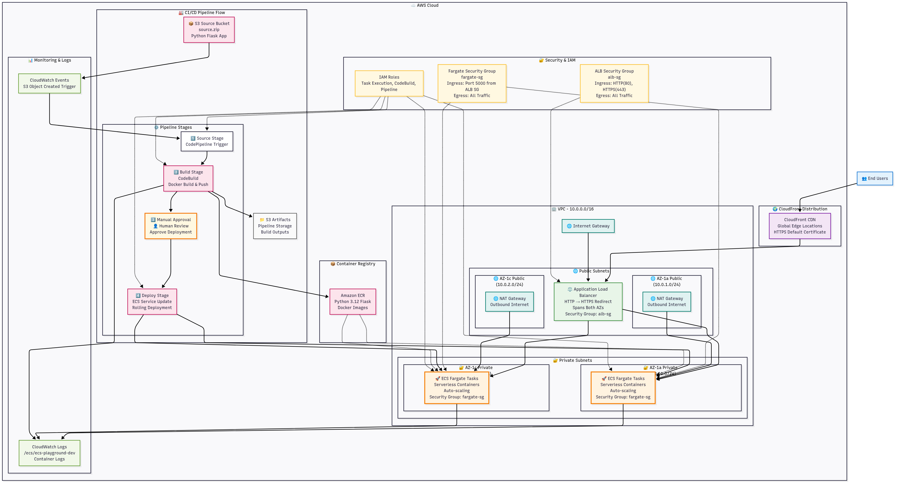

# ECS Playground - Serverless Container Demo

> Simple AWS Fargate deployment with Terraform and CI/CD pipeline

## 🎓 Learning Purpose

This repository is designed for **learning Infrastructure as Code (IaC), container orchestration, and CI/CD practices** using AWS services. It demonstrates:

- **Infrastructure as Code**: Complete Terraform configuration with modular design
- **Container Orchestration**: AWS ECS Fargate for serverless container management
- **CI/CD Pipeline**: Automated build, test, and deployment workflows
- **Best Practices**: Security, scalability, and operational excellence patterns

Perfect for developers and DevOps engineers who want to understand modern cloud-native architectures and deployment strategies.

## 📍 Repository
**Clone the repository**:
```bash
git clone https://github.com/toasobi-lab/terraform-ecs-pipeline.git
cd terraform-ecs-pipeline
```

---

## 🚀 Quick Start

1. **Configure**
   ```bash
   cp terraform.tfvars.example terraform.tfvars
   # Edit terraform.tfvars if needed (defaults work for Tokyo region)
   ```

2. **Deploy Infrastructure**
   ```bash
   terraform init
   terraform apply
   ```

3. **Deploy Application**
   ```bash
   cd app && zip -r ../source.zip . && cd ..
   aws s3 cp source.zip s3://$(terraform output -raw s3_source_bucket_name)/source.zip
   ```

4. **Approve Deployment**
   - Go to AWS Console → CodePipeline
   - Approve the deployment when pipeline pauses

5. **Access Application**
   ```bash
   echo "Application URL: https://$(terraform output -raw cloudfront_domain_name)"
   ```

## 🏗️ Architecture



**Flow**: User → CloudFront → ALB → Fargate Tasks  
**Region**: Tokyo (ap-northeast-1)  
**Compute**: AWS Fargate (serverless containers)  
**Network**: Private subnets across 2 AZs  
**CI/CD**: S3 → CodeBuild → Manual Approval → ECS Deploy  

## 🎯 Design Philosophy

This infrastructure demonstrates a **production-ready, serverless container architecture** with the following design principles:

### **Security-First Approach**
- **Network Isolation**: ECS tasks run in private subnets with no direct internet access
- **Security Groups**: Strict ingress/egress rules with least privilege access
- **IAM Roles**: Separate execution and task roles with minimal required permissions
- **Encryption**: All data at rest and in transit is encrypted (S3, ECR, CloudWatch)

### **High Availability & Scalability**
- **Multi-AZ Deployment**: Resources distributed across 2 availability zones
- **Auto Scaling**: CPU and memory-based scaling policies (70% CPU, 80% memory)
- **Load Balancing**: Application Load Balancer with health checks
- **Global CDN**: CloudFront for improved performance and DDoS protection

### **Operational Excellence**
- **Infrastructure as Code**: Complete Terraform configuration with modular design
- **CI/CD Pipeline**: Automated build, test, and deployment with manual approval
- **Monitoring**: CloudWatch logs and metrics for observability
- **Cost Optimization**: Fargate for pay-per-use compute, no idle costs

## 🔧 ECS Design Deep Dive

### **Container Architecture**
```yaml
Task Definition:
  - Network Mode: awsvpc (dedicated ENI per task)
  - Launch Type: FARGATE (serverless)
  - CPU: 256 vCPU units (0.25 vCPU)
  - Memory: 512 MB
  - Health Check: HTTP endpoint with curl
  - Logging: CloudWatch Logs with structured format
```

### **Service Configuration**
- **Desired Count**: 2 tasks for high availability
- **Auto Scaling**: 2-6 tasks based on resource utilization
- **Deployment Strategy**: Rolling updates with health checks
- **Load Balancer Integration**: ALB target group with health checks

### **Security Implementation**
- **Task Execution Role**: Pulls images from ECR, writes to CloudWatch
- **Task Role**: Application permissions (minimal scope)
- **Network Security**: Private subnets, NAT Gateway for outbound traffic
- **Container Security**: Non-root user, read-only filesystem where possible

## 🔄 CI/CD Pipeline Design

### **Pipeline Stages**

#### **1. Source Stage**
```yaml
Trigger: S3 Object Created (source.zip)
Source: S3 bucket with versioning and encryption
Output: Source code artifact
```

#### **2. Build Stage**
```yaml
Builder: CodeBuild with Amazon Linux 2
Process:
  - ECR Authentication
  - Docker Build & Tag
  - Push to ECR (latest + commit hash)
  - Generate imagedefinitions.json
```

#### **3. Approval Stage**
```yaml
Type: Manual approval
Purpose: Security review, testing validation
Configuration: Custom approval message
```

#### **4. Deploy Stage**
```yaml
Provider: ECS Deploy
Action: Update service with new task definition
Strategy: Rolling deployment with health checks
```

### **Build Process Details**
```bash
# BuildSpec Workflow:
1. ECR Login (secure token-based authentication)
2. Docker Build (multi-stage for optimization)
3. Image Tagging (latest + git commit hash)
4. Push to ECR (versioned images)
5. Generate deployment manifest
```

### **Security Features**
- **Encrypted Artifacts**: S3 buckets with AES256 encryption
- **IAM Integration**: Least privilege roles for each pipeline stage
- **Audit Trail**: CloudWatch Events for pipeline triggers
- **Manual Approval**: Human oversight for production deployments

## 📦 Infrastructure Components

### **Networking Layer**
- **VPC**: Custom CIDR with public/private subnets across 2 AZs
- **NAT Gateway**: Outbound internet access for private resources
- **Route Tables**: Proper routing for public/private traffic
- **Security Groups**: Layer-specific access controls

### **Compute Layer**
- **ECS Cluster**: Fargate-only cluster with container insights
- **Task Definition**: Optimized for Flask application
- **Service**: Auto-scaling with health monitoring
- **Load Balancer**: ALB with SSL termination and health checks

### **Storage & Registry**
- **ECR**: Private container registry with lifecycle policies
- **S3**: Source code and artifact storage with versioning
- **CloudWatch**: Centralized logging and monitoring

### **CDN & Edge**
- **CloudFront**: Global content delivery with HTTPS
- **SSL Certificate**: ACM-managed certificate
- **Cache Policy**: Optimized for dynamic content

## 🔍 Monitoring & Observability

### **Logging Strategy**
- **Application Logs**: Structured JSON logging to CloudWatch
- **Container Logs**: ECS task logs with retention policies
- **Pipeline Logs**: CodeBuild and CodePipeline execution logs
- **Access Logs**: ALB and CloudFront access logs

### **Metrics & Alarms**
- **ECS Metrics**: CPU, memory, network utilization
- **ALB Metrics**: Request count, response time, error rates
- **Auto Scaling**: Scale-in/scale-out events
- **Cost Monitoring**: Resource utilization and cost tracking

## 🧹 Cleanup

```bash
terraform destroy
```

### State Cleanup
```bash
# Remove Terraform state files
rm -rf .terraform
rm -f .terraform.lock.hcl
rm -f terraform.tfstate
rm -f terraform.tfstate.backup
```

## 🚀 Production Considerations

### **Scaling Strategies**
- **Horizontal Scaling**: Auto-scaling based on CPU/memory metrics
- **Vertical Scaling**: Adjust task CPU/memory for different workloads
- **Scheduled Scaling**: Scale down during off-hours for cost optimization

### **Security Hardening**
- **Secrets Management**: Use AWS Secrets Manager for sensitive data
- **Network Policies**: Implement network ACLs for additional security
- **Container Scanning**: Integrate ECR vulnerability scanning
- **Runtime Security**: Consider AWS Security Hub and GuardDuty

### **Disaster Recovery**
- **Multi-Region**: Deploy to multiple regions for RTO/RPO requirements
- **Backup Strategy**: ECR image versioning, S3 cross-region replication
- **Monitoring**: Set up alerts for service health and performance

---

**Tech Stack**: Python 3.12 • Flask • Docker • AWS Fargate • Terraform • CodePipeline • CloudFront
